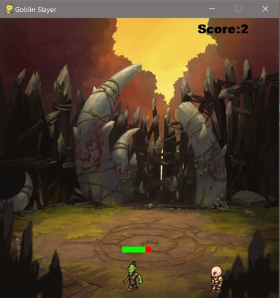
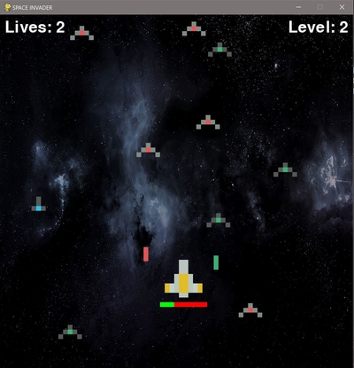

# Pygamez
## A collection of games built with Python

This repository houses arcade-style games which were built with 
Pygame modules. You will find additional README.txt's attached to 
each game which go into depth on their functionalities and frameworks.

### Current games in the repository:
- Goblin Slayer
- Space Invaders

### Goblin Slayer

### Space Invaders

